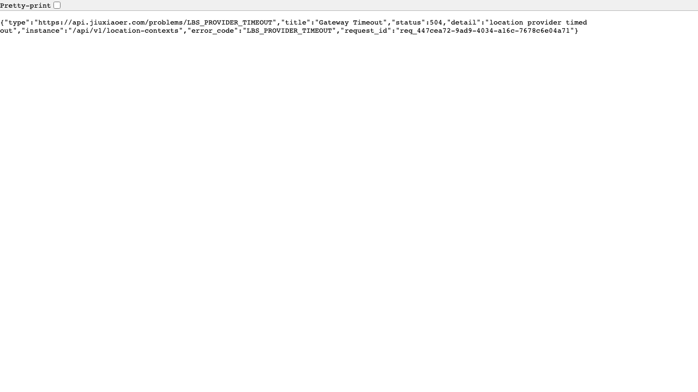
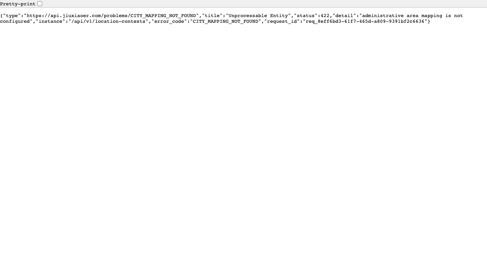

# QA Report: Customer LBS Backend Real Amap

| Field | Value |
|-------|-------|
| **Date** | 2026-07-17 |
| **URL** | `http://localhost:8080` |
| **Branch** | `main` |
| **Commit** | `11bd00f3` (the root repository currently treats `backend-go/` as untracked) |
| **Mode** | Report-only, no fixes |
| **Scope** | Go backend Customer LBS, real Amap Web Service key, MySQL and Redis |
| **Duration** | 9 minutes |
| **API cases** | 18 |
| **Screenshots** | 4 |
| **Framework** | Go 1.26.1, Gin |

## Status: DONE_WITH_CONCERNS

The real Amap key is valid for both reverse geocoding and electric-bicycle routing. The complete Nanshan flow works, including context creation, Amap route refinement, cache reuse, context binding, shop switching, and downstream public reads. Two high-severity environment/data issues prevent broad rollout.

## Health Score: 93/100

| Category | Score |
|----------|-------|
| Console | 100 |
| Links | 100 |
| Visual/API docs | 100 |
| Functional | 70 |
| UX/error contracts | 100 |
| Performance | 85 |
| Accessibility | 100 |

## Real Amap Contract Results

| Call | HTTP | Amap result | Observed time | Key exposed |
|------|------|-------------|---------------|-------------|
| `/v3/geocode/regeo` | 200 | `status=1`, `infocode=10000`, Shenzhen/Futian `440304` | 1.460s | No |
| `/v5/direction/electrobike` | 200 | `status=1`, `infocode=10000`, one route | 1.425s | No |
| Nanshan cold business resolve with test timeout overrides | 200 | Exact address, shop `4201`; route refinement degraded | 3.007s | No |
| Nanshan warm business resolve | 200 | Amap route `1600m / 351s`; no degradation | 0.355s | No |

## Backend Flow Matrix

| Case | Result | Evidence |
|------|--------|----------|
| Health and Swagger | PASS | `/readyz` 200; Swagger 200 with no console errors |
| Published service cities | PASS | Shenzhen `440300` returned |
| Manual city context | PASS | 200, browse-only, `PRECISE_LOCATION_REQUIRED` state |
| Device location in configured Nanshan district | PASS | 200, exact address and selected shop `4201` |
| Amap route refinement | PASS | `route_source=amap`, `1600m`, `351s` on warm resolve |
| Location-context cache | PASS | Warm resolve 0.355s; metrics show fresh regeo/route hits |
| Context-to-session binding | PASS | Cross-session candidate read returns 403 `LOCATION_CONTEXT_FORBIDDEN` |
| Manual shop switch | PASS | Version advanced from 1 to 2; selection source became `manual` |
| Idempotent switch replay | PASS | Same idempotency key returns identical `data` |
| Stale version protection | PASS | 409 `LOCATION_CONTEXT_VERSION_CONFLICT` |
| Home consumes context | PASS | 200, selected shop `4201` |
| Categories/products/shops consume context | PASS | 200; 5 categories, 5 products, 1 shop |
| Missing anonymous session | PASS | 400 `ANONYMOUS_SESSION_REQUIRED` |
| Stale device location | PASS | 400 `VALIDATION_FAILED` |
| Low-accuracy device location | PASS | 422 `LOCATION_ACCURACY_LOW` |

## Top Things to Fix

1. **ISSUE-001: Default provider timeouts reject normal cold Amap calls.**
2. **ISSUE-002: Published Shenzhen coverage lacks Futian administrative mapping.**

## Console Health

Swagger loaded without JavaScript console errors. Backend logs contained request IDs and result metadata, with no Amap key or raw coordinate logging observed.

## Summary

| Severity | Count |
|----------|-------|
| Critical | 0 |
| High | 2 |
| Medium | 0 |
| Low | 0 |
| **Total** | **2** |

## Issues

### ISSUE-001: Default provider timeouts reject normal cold Amap calls

| Field | Value |
|-------|-------|
| **Severity** | high |
| **Category** | performance / functional |
| **URL** | `POST /api/v1/location-contexts` |

**Description:** With the checked-in defaults used by `.env.local`, the first real location resolve returned HTTP 504 after 804ms with `LBS_PROVIDER_TIMEOUT`. A direct request using the same key and coordinate succeeded, but reverse geocoding took 1.460s and routing took 1.425s. Even with test-process overrides of 2s for each provider call and 3s overall, the first Nanshan resolve completed in 3.007s with route degradation. The subsequent cached request completed in 0.355s with a valid Amap route.

**Repro Steps:**

1. Start the backend with `make run`, using the current `.env.local` defaults.
2. Send a fresh, accurate GCJ-02 device-location request with a new `X-Session-ID`.
3. Observe HTTP 504 `LBS_PROVIDER_TIMEOUT` after approximately 804ms.

### ISSUE-002: Published Shenzhen coverage lacks Futian administrative mapping

| Field | Value |
|-------|-------|
| **Severity** | high |
| **Category** | functional |
| **URL** | `POST /api/v1/location-contexts` |

**Description:** The public API publishes Shenzhen as a service city, but the admin API lists only city-level `440300` and Nanshan `440305` mappings. Real reverse geocoding at Shenzhen Civic Center returns Futian `440304`; the business API then returns HTTP 422 `CITY_MAPPING_NOT_FOUND`. The same flow succeeds in Nanshan.

**Repro Steps:**

1. Send an accurate GCJ-02 location for Shenzhen Civic Center with `city_code_hint=440300`.
2. Confirm Amap returns Shenzhen/Futian adcode `440304`.
3. Observe HTTP 422 `CITY_MAPPING_NOT_FOUND` from the business endpoint.

## Fixes Applied

None. This was a report-only backend QA run.

## Ship Readiness

| Metric | Value |
|--------|-------|
| Health score | 93/100 |
| Issues found | 2 high |
| Fixes applied | 0 |
| Verified service area | Nanshan |
| Broad Shenzhen rollout | Not ready |

**PR Summary:** "Real Amap QA verified the Nanshan Customer LBS flow end to end; found two high-severity rollout blockers in cold-call timeout settings and Futian adcode coverage."
